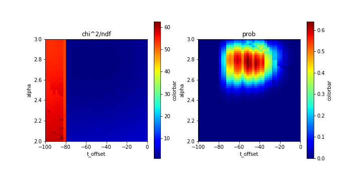

# ksc2022-7

## 08/28からの変更点

08/28の時は，フィッティング関数に縦軸方向のオフセットを入れていた．
```root:fitting1.C
TF1 *f4 = new TF1("f4", "[0]*cos(2*TMath::Pi()*x/[1]) + [2]");
```
けれど，本来アシンメトリーは縦軸方向にオフセットのない三角関数になるべきなので，縦軸方向のオフセットを無くしました．
ついで，時間方向のオフセットを入れました．

```root:fitting1.C
TF1 *f4 = new TF1("f4", "[0]*cos(2*TMath::Pi()*x/[1] + [2])");
```
これをフィッティング関数として採用します．


## 適切なパラメータの探索

DとUのアシンメトリー $A$ は
$$A = \frac{\alpha N_D(t + t_{\textrm{offset}}) - N_U(t)}{\alpha N_D(t + t_{\textrm{offset}}) + N_U(t)}$$
と定義する．ここでパラメータ $\alpha$ はカウンターDとUの検出効率の補正値，パラメータ $t_{\textrm{offset}}$ はDの時間方向のオフセットである．

パラメータ $\alpha$ と $t_{\textrm{offset}}$ を変えながら $A$ を上記のフィッティング関数f4でフィットし，その $\chi^2$ 誤差やProbabilityがよくなるパラメータの値を探索する．


初めに， $0.1 \leq \alpha \leq 5.1$ ,  $-200 \leq t_{\textrm{offset}} \leq 200$の範囲で探索した．
結果， $\chi^2$ 誤差やProbabilityは以下のようになった．


$\alpha = 2.2$,  $t_{\textrm{offset}} = -50$ 付近と， $\alpha = 2.7$ ,  $t_{\textrm{offset}} = 110$ 付近に，周囲より $\chi^2 / \textrm{ndf}$ が小さく，Probabilityが大きい部分がある．

### $\alpha = 2.2$, $t_{\textrm{offset}} = -50$付近

より細かく付近の$\chi^2$ 誤差やProbabilityを調べると以下のようであった．



